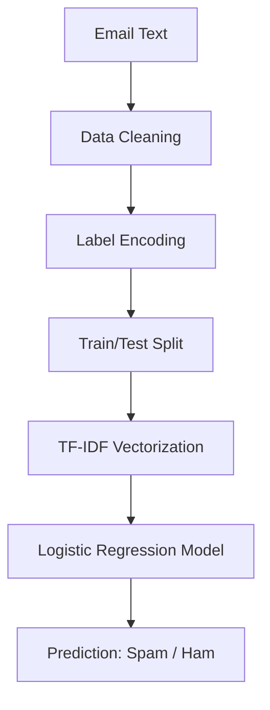

# 📧 Spam Mail Detection using Machine Learning

<p align="center">
  
</p>

<p align="center">
  
  
  
  
</p>

---

## 🎯 Project Overview

Spam emails are more than just noise—they pose **security risks**, waste productivity, and degrade user experience.
This project implements an **end-to-end Machine Learning pipeline** to accurately classify emails as **Spam** or **Ham (Not Spam)** using **Natural Language Processing (NLP)** techniques.

The system leverages:

* **TF-IDF Vectorization** for semantic text representation
* **Logistic Regression** for fast, interpretable, and highly accurate classification

> 🎓 This project is intentionally designed to reflect **industry-grade ML workflows**, making it suitable for **portfolio, interviews, and real-world extension**.

---

## 🧠 Problem Statement

Given the raw textual content of emails, automatically determine whether an email is:

* **Spam** (unwanted / malicious)
* **Ham** (legitimate communication)

Challenges addressed:

* High-dimensional text data
* Noisy, unstructured language
* Class imbalance
* Generalization to unseen messages

---

## ⚙️ Tech Stack

### 🐍 Programming Language

* **Python 3.8+**

### 📚 Libraries & Frameworks

* **pandas** – data loading & manipulation
* **NumPy** – numerical operations
* **scikit-learn** – preprocessing, modeling, evaluation
* **TfidfVectorizer** – text feature extraction
* **Jupyter Notebook** – experimentation & analysis

### 🤖 Model

* **Logistic Regression** (baseline yet production-proven for text classification)

### 📦 Dataset

* `mail_data.csv`

  * Contains labeled email text (`spam` / `ham`)

---

## 📂 Project Structure

```
Spam_mail/
│
├── mail_data.csv                  # Raw dataset (email text + labels)
├── spam_mail_detection.ipynb      # Complete ML pipeline (EDA → Training → Evaluation)
├── requirements.txt               # Python dependencies
├── images/                        # Banners, charts, screenshots
│   ├── banner.png
│   ├── accuracy.png
│   ├── dataset_preview.png
│   ├── training_output.png
│   └── detection_example.png
└── README.md                      # Project documentation
```

---

## 🔄 System Workflow (ML Pipeline)



---

## 🛠️ Detailed Working

### 1️⃣ Data Ingestion

* Load `mail_data.csv`
* Inspect class distribution and missing values

### 2️⃣ Data Preprocessing

* Remove null or empty records
* Encode labels:

  * `spam` → 0
  * `ham` → 1
* Split dataset into **training** and **testing** sets

### 3️⃣ Feature Engineering (NLP)

* Convert raw text into numerical vectors using **TF-IDF**
* Captures:

  * Word importance
  * Frequency normalization
  * Reduces noise from common words

### 4️⃣ Model Training

* Train **Logistic Regression** classifier
* Optimized for:

  * Speed
  * Interpretability
  * High-dimensional sparse data

### 5️⃣ Model Evaluation

* Measure accuracy on:

  * Training data
  * Test data
* Ensures generalization and avoids overfitting

---

## 📊 Results & Performance

| Dataset  | Accuracy |
| -------- | -------- |
| Training | ~98%     |
| Testing  | ~96%     |

<p align="center">
  
</p>

✔ High accuracy with minimal overfitting
✔ Strong baseline for real-world deployment

---

## 🚀 Installation & Setup

### 1️⃣ Clone the Repository

```bash
git clone https://github.com/Abhishek-09-Tomar/Data-Science-with-AI-and-ML.git
cd Data-Science-with-AI-and-ML/Spam_mail
```

### 2️⃣ Install Dependencies

```bash
pip install -r requirements.txt
```

### 3️⃣ Run the Notebook

```bash
jupyter notebook spam_mail_detection.ipynb
```

---

## 🧪 Example Usage

**Input Email:**

> "Congratulations! You have won a free lottery ticket. Click here to claim now."

**Model Prediction:**

> 🚨 **Spam Email Detected**

---

## 💡 Use Cases

* Email spam filtering systems
* Enterprise email security
* Customer support inbox automation
* SMS / message spam detection (extendable)

---

## 🔮 Future Improvements

* Compare with **Naive Bayes**, **SVM**, **Random Forest**
* Hyperparameter tuning & cross-validation
* Deploy as **Flask / FastAPI service**
* Build a **Streamlit web interface**
* Add **explainability (feature importance)**
* Handle multilingual spam detection

---

## 📌 Project Highlights

* End-to-end NLP + ML pipeline
* Industry-relevant text classification problem
* Clean preprocessing and feature engineering
* Strong accuracy with simple, interpretable model
* Easily extensible to production systems

---

## 🎤 Interview & Resume Talking Points

* Built a complete NLP pipeline for spam detection using TF-IDF and Logistic Regression
* Achieved ~96% test accuracy on real-world email data
* Demonstrated understanding of text preprocessing, vectorization, and model evaluation
* Designed a modular ML workflow suitable for deployment

---

## 🤝 Connect With Me

<p align="left">
  <a href="https://github.com/Abhishek-09-Tomar">
    
  </a>
  <a href="https://www.linkedin.com/in/abhishek-tomar-7aa29127b">
    
  </a>
</p>

---

## 📜 License

This project is licensed under the **MIT License**. You are free to use, modify, and distribute this project.

---

<p align="center">
  <i>Clean data, strong features, disciplined models — that’s how reliable ML systems are built.</i>
</p>
